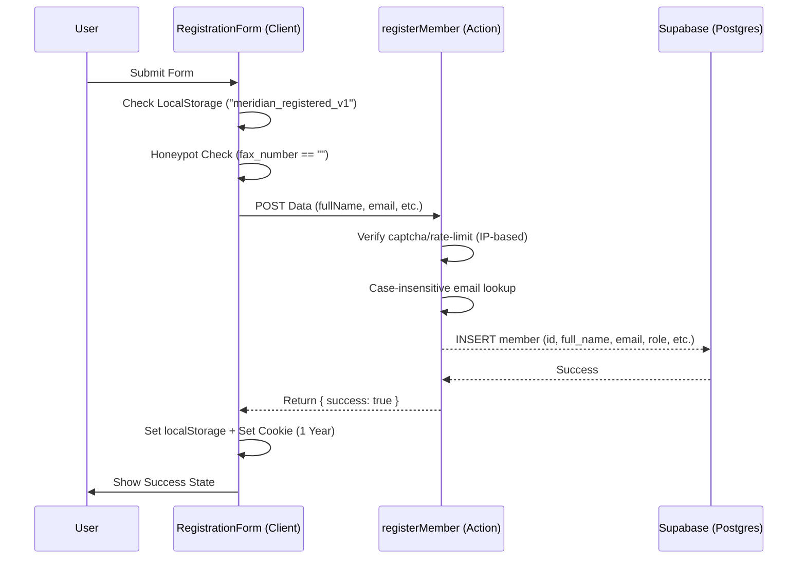

# The Meridian Society — Ultra-Detailed Technical Specification

This document is the definitive, high-fidelity system of record for The Meridian Society website. It serves as an **"Agent-Ready" encyclopedia** of the site's architecture, security, data logic, and performance systems.

---

## 🏗️ 1. Architecture: Responsive Single-View Pattern

The site implements a unified, mobile-first component tree. We avoid separate mobile/desktop routes, instead relying on CSS media queries and the `PageStyles` pattern to adapt the UI.

### 1.1 Source-to-Route Mapping
| Public URL | Route Directory | Primary Logic | CSS Logic |
| :--- | :--- | :--- | :--- |
| `/` | `app/(site)/` | `page.tsx` | `pageCss.ts` |
| `/events` | `app/(site)/events/` | `page.tsx` | `pageCss.ts` |
| `/membership`| `app/(site)/membership/` | `page.tsx` | `pageCss.ts` |
| `/social` | `app/(site)/social/` | `page.tsx` | `pageCss.ts` |
| `/speak` | `app/(site)/speak/` | `page.tsx` | `pageCss.ts` |
| `/team` | `app/(site)/team/` | `page.tsx` | `pageCss.ts` |
| `/register` | `app/register/` | `page.tsx` | (Shared `globals.css`) |

---

## 🛡️ 2. The Registration Pipeline (Hardened)

The registration flow (`/register`) is the most mission-critical and hardened part of the site.

### 2.1 Registration Flow Diagram


### 2.2 Security Guards
- **Honeypot**: A hidden `fax_number` field. If filled, the server action fails instantly.
- **Client Guard**: `localStorage.getItem("meridian_registered_v1")` and `document.cookie` check to prevent duplicate form rendering.
- **Server Guard**: Service client (`utils/supabase/service.ts`) used for case-insensitive email lookup to bypass RLS for verification before insertion.

---

## ✨ 3. Animation Engine & Reveal Lifecycle

The site utilizes a strict "Observer-Reveal" pattern managed through `Providers.tsx`.

### 3.1 Intersection Observer (`.rv`)
- **Properties**: `threshold: 0.01`, `rootMargin: "0px 0px 100px 0px"`.
- **Logic**: Elements with `.rv` class gain the `.on` class when entering the viewport.
- **Stagger Timings**: 
    - `data-d="1"`: 80ms delay
    - `data-d="2"`: 160ms delay
    - `data-d="3"`: 240ms delay
    - `data-d="4"`: 320ms delay
    - `data-d="5"`: 400ms delay
- **Keyframes**:
    - `pageSweep`: `0.65s` cubic-bezier(0.16, 1, 0.3, 1). (Opacity: 0->1, Blur: 8px->0, TranslateY: 10px->0).
    - `riseIn`: `0.8s` cubic-bezier(0.16, 1, 0.3, 1). (Opacity: 0->1, TranslateY: 16px->0).

---

## 🗄️ 4. Backend Architecture: Supabase & SQL

### 4.1 SQL Trigger: Live Member Counting
```sql
-- Automated Counter Trigger
CREATE OR REPLACE FUNCTION public.handle_member_count_change()
RETURNS TRIGGER AS $$
BEGIN
    IF (TG_OP = 'INSERT') THEN
        UPDATE public.site_stats
        SET member_count = member_count + 1,
            last_updated = now()
        WHERE id = 'meridian_global_stats';
    ELSIF (TG_OP = 'DELETE') THEN
        UPDATE public.site_stats
        SET member_count = member_count - 1,
            last_updated = now()
        WHERE id = 'meridian_global_stats';
    END IF;
    RETURN NULL;
END;
$$ LANGUAGE plpgsql SECURITY DEFINER;
```

### 4.2 Row Level Security (RLS) Policies
- **`members`**: **Strict Lockdown**. Anonymous `INSERT` is disabled. All growth happens through the `registerMember` Server Action (which uses the Service Role).
- **`site_stats`**: `Public can view stats` (FOR SELECT USING true).

---

## ⚡ 5. Performance & Infrastructure

### 5.1 Lighthouse Performance Goals
Agents must maintain the following scores:
- **Performance**: 95+ (Critical for premium user experience)
- **Accessibility**: 100 (Strict WCAG 2.1 compliance)
- **Best Practices**: 100
- **SEO**: 100 (Dynamic sitemap + robots.txt)

### 5.2 Optimization Strategies
- **Images**: Mandatory `.webp` format. Team headshots must be <20KB.
- **Fonts**: Preloaded via `next/font` (Barlow Condensed, Cormorant Garamond).
- **CSS**: Tailwind 4 theme-layer optimization in `globals.css`.
- **Telemetry**: Edge API Route (`/api/stats/count`) with SWR (`stale-while-revalidate=300`) to eliminate DB fetch latency for the public count.

---

## 🔒 6. Infrastructure & Deployment

### 6.1 Environment Variables
| Key | Usage | Security |
| :--- | :--- | :--- |
| `NEXT_PUBLIC_SUPABASE_URL` | Client/Server DB endpoint | Public |
| `NEXT_PUBLIC_SUPABASE_ANON_KEY` | Client-side RLS limited key | Public |
| `SUPABASE_SERVICE_ROLE_KEY` | **Admin access** | **PRIVATE (Server Only)** |

---
*For site management, see [README.md](README.md).*
